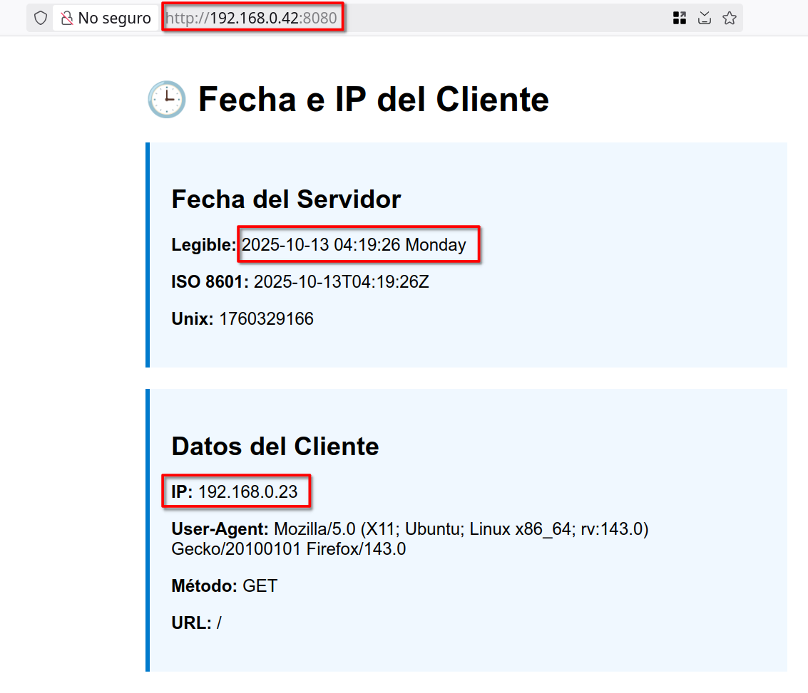

# Tutorial Servidor Web para app básica en Go

Este tutorial te guiará paso a paso para crear una aplicación web básica en Go que muestre la fecha actual y la dirección IP del cliente, desplegada en Ubuntu Server 24.04. Cada paso incluye una breve explicación de su propósito.

## Prerrequisitos

- Ubuntu Server 24.04 instalada con acceso root o sudo  
- Acceso SSH o mosh al servidor (para gestionar remotamente el servidor)  
- IDE con acceso remoto al servidor para edición de archivos

## 1: Instalación de Go en Ubuntu Server 24.04

### 1.1 Actualizar el Sistema

```sh
sudo apt update
sudo apt upgrade -y
```


### 1.2 Instalar Go

```sh
sudo apt install golang -y
```

Descargamos e instala el compilador e infraestructura de Go desde los repositorios oficiales de Ubuntu.

### 1.3 Verificar la Instalación

Para confirmar Go se instaló correctamente y muestra la versión instalada, garantizando que los comandos posteriores funcionarán.

```sh
go version
```


### 1.4 Configurar Variables de Entorno

```sh
nano ~/.profile
```

Agrega:

```sh
export PATH=$PATH:/usr/local/go/bin
export GOPATH=$HOME/go
export PATH=$PATH:$GOPATH/bin
```
```
source ~/.profile
```

Al definir `GOPATH` (directorio de trabajo de Go) y asegurar que los ejecutables de Go estén en el `PATH` facilitamos la ejecución de comandos desde cualquier ubicación.

## 2: Crear la Aplicación Web en Go

### 2.1 Crear el Directorio del Proyecto

```sh
mkdir ~/webapp
cd ~/webapp
```

Organizamos el código en un directorio dedicado, manteniendo tu espacio de trabajo limpio y estructurado.

### **2.2 Crear el Archivo Principal**

```sh
nano main.go
```

Iniciamos el desarrollo creando el archivo donde irá todo el código fuente de la aplicación.

### **2.3 Pegar el Código Fuente**

```go
package main

import (
    "fmt"
    "log"
    "net"
    "net/http"
    "strings"
    "time"
)

// Obtiene la IP del cliente considerando proxies
func getClientIP(r *http.Request) string {
    if x := r.Header.Get("X-Forwarded-For"); x != "" {
        parts := strings.Split(x, ",")
        if ip := strings.TrimSpace(parts[0]); ip != "" {
            return ip
        }
    }
    if ip := r.Header.Get("X-Real-IP"); ip != "" {
        return ip
    }
    if ip := r.Header.Get("CF-Connecting-IP"); ip != "" {
        return ip
    }
    host, _, err := net.SplitHostPort(r.RemoteAddr)
    if err != nil {
        return r.RemoteAddr
    }
    return host
}

// Muestra la página HTML con fecha e IP
func homeHandler(w http.ResponseWriter, r *http.Request) {
    now := time.Now()
    dateFriendly := now.Format("2006-01-02 15:04:05 Monday")
    dateISO := now.Format(time.RFC3339)
    clientIP := getClientIP(r)

    html := fmt.Sprintf(`
<!DOCTYPE html>
<html>
<head>
  <title>Info Cliente - Go Server</title>
  <meta charset="UTF-8">
  <style>
    body { font-family: Arial; max-width:600px; margin:40px auto; }
    .box { background:#f0f8ff; padding:20px; margin-bottom:20px; border-left:4px solid #007acc; }
  </style>
</head>
<body>
  <h1>🕒 Fecha e IP del Cliente</h1>
  <div class="box">
    <h2>Fecha del Servidor</h2>
    <p><strong>Legible:</strong> %s</p>
    <p><strong>ISO 8601:</strong> %s</p>
    <p><strong>Unix:</strong> %d</p>
  </div>
  <div class="box">
    <h2>Datos del Cliente</h2>
    <p><strong>IP:</strong> %s</p>
    <p><strong>User-Agent:</strong> %s</p>
    <p><strong>Método:</strong> %s</p>
    <p><strong>URL:</strong> %s</p>
  </div>
</body>
</html>
`, dateFriendly, dateISO, now.Unix(),
    clientIP, r.Header.Get("User-Agent"), r.Method, r.URL.Path)

    w.Header().Set("Content-Type", "text/html; charset=utf-8")
    fmt.Fprint(w, html)
    log.Printf("IP %s - %s", clientIP, r.URL.Path)
}

// API JSON con datos
func apiHandler(w http.ResponseWriter, r *http.Request) {
    now := time.Now()
    clientIP := getClientIP(r)
    json := fmt.Sprintf(`{
  "timestamp":"%s",
  "unix":%d,
  "ip":"%s"
}`, now.Format(time.RFC3339), now.Unix(), clientIP)

    w.Header().Set("Content-Type", "application/json")
    fmt.Fprint(w, json)
}

func main() {
	http.HandleFunc("/", homeHandler)
	http.HandleFunc("/api", apiHandler)
	addr := "0.0.0.0:8080"
	log.Printf("Servidor iniciado en %s", addr)
	log.Fatal(http.ListenAndServe(addr, nil))
}
```

Este código define dos rutas (`/` y `/api`), obtiene la IP correcta del cliente, formatea la fecha y genera la respuesta HTML o JSON.

## **3: Inicializar y Probar la Aplicación**

### **3.1 Inicializar el Módulo Go**

```sh
go mod init webapp
go mod tidy
```

Creamos un módulo Go para gestionar dependencias de forma ordenada.


### **3.2 Ejecutar para Pruebas**

```sh
go run main.go
```

Inicia el servidor sin compilar, útil para verificar que no haya errores.

si desde el equipo anfitrión visitamos las siguientes direcciones comprobamos las dos recursos a los que podemos acceder en la aplicación:

- `http://ip_host:8080`  
- `http://ip_host:8080/api`  

Donde `ip_host` es la dirección IP del servidor enla que se ejecuta la aplicación.


### 3.3 Compilar el Ejecutable
```
go build -o webapp main.go
```
Generamos un binario independiente (`webapp`) para desplegar en producción.

Se creará un fichero ejecutable de nombre `webapp`. A partir de ahora podemos lanzar la aplicación web ejecutando `./webapp`

## 4. Configurar como Servicio systemd

La forma más sencilla y fiable de desplegar una aplicación en Go consiste en compilar la aplicación como un binario estático y ejecutarla como servicio. 

Con los pasos anteriores hemos compilado la aplicación y generado un binario estático. Vamos a ver ahora como ejecutarla como servicio.

### 4.1 Crear el Archivo de Servicio

Creamos el fichero con la definición del servicio:
```sh
sudo nano /etc/systemd/system/webapp.service
```

Insertamos en el archivo:

```
[Unit]
Description=Go WebApp Fecha e IP
After=network.target

[Service]
Type=simple
User=isard
WorkingDirectory=/home/user/webapp
ExecStart=/usr/local/bin/webapp
Restart=on-failure
Environment=PORT=8080
StandardOutput=journal
StandardError=journal

[Install]
WantedBy=multi-user.target
```
De esta forma se define cómo y cuándo `systemd` levanta tu aplicación, asegurando reinicio en fallos y arranque automático al iniciar el servidor.

### 4.2 Mover el Ejecutable

```
sudo cp webapp /usr/local/bin/
sudo chmod +x /usr/local/bin/webapp
```
Situamos el binario en un directorio estándar (`/usr/local/bin`) accesible por systemd y otros usuarios.

### 4.3 Arrancar y Habilitar el Servicio

```
sudo systemctl daemon-reload
sudo systemctl start webapp
sudo systemctl enable webapp
```

Recargamos la configuración, se inicia el servicio y lo habilita para futuros reinicios del host.

## 5 Configurar el Firewall

```
sudo ufw allow 8080
sudo ufw status
```

Permitimos el tráfico HTTP en el puerto 8080 y verifica el estado de las reglas de firewall.

## 6 Pruebas y Monitoreo

- **Prueba Local**:  
  ```
  curl http://localhost:8080
  curl http://localhost:8080/api
  ```
  Propósito: Verifica que el servidor responde correctamente.

- **Prueba Externa**:  
  Abre `http://TU_IP_DEL_SERVIDOR:8080` en tu navegador.




- **Ver Logs en Tiempo Real**:  

  ```
  sudo journalctl -u webapp -f
  ```
  Observamos las solicitudes y errores según ocurren para detectar y solucionar problemas.


  
